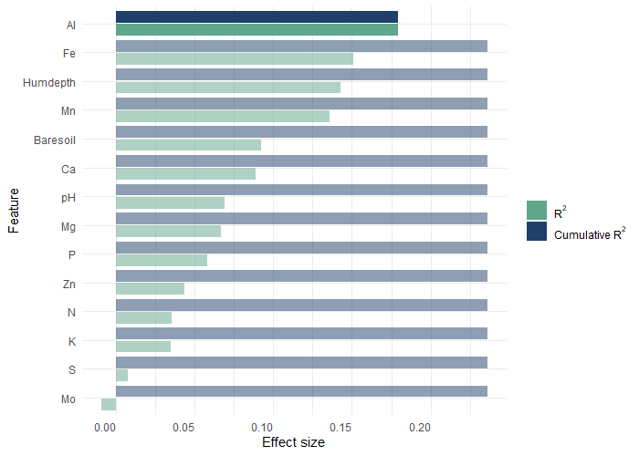

<!-- badges: start -->
[](https://github.com/raeslab/RLdbRDA/actions/workflows/R-CMD-check.yaml) [](https://creativecommons.org/licenses/by-nc-sa/4.0/)
<!-- badges: end -->

# RLdbRDA: RaesLab distance-based Redundancy Analysis

The RLdbRDA package provides a streamlined workflow for performing distance-based redundancy analysis (db-RDA) as is done in the RaesLab on microbial datasets, enabling researchers to identify and visualize the influence of metadata variables on community composition.

## Installation


LRdbRDA needs to be installed directly from GitHub using devtools. From an R console enter the commands below.


```commandline
library(devtools)
install_github("raeslab/LRdbRDA")
```

If you are using ```renv```, instead use the commands below to install this package.

```commandline
renv::install("raeslab/LRdbRDA")
```


## Usage

To run RLdbRDA two dataframes are needed: one with the microbial abundances and one with metadata. In both cases rows should be samples/subject and columns microbiota and metadata features respectively. 

Off note, it is strongly recommended to **remove strongly correlated features from the metadata** before running RLdbRDA. Furthermore, RLdbRDA cannot handle missing values in the metadata. **Features with many missing values should be excluded** first, next **samples/subjects with incomplete cases should be removed** (or imputed if possible).

### Example

```R
library(RLdbRDA)
library(vegan)

data(varespec)
data(varechem)

out <- rldbrda(varespec, varechem)
out

plot_data <- prepare_plot_data(out)
plot_data

g <- plot_dbrda(plot_data)
g
```



## Contributing

Any contributions you make are **greatly appreciated**.

  * Found a bug or have some suggestions? Open an [issue](https://github.com/raeslab/RLdbRDA/issues).
  * Pull requests are welcome! Though open an [issue](https://github.com/raeslab/RLdbRDA/issues) first to discuss which features/changes you wish to implement.

## Contact

RLdbRDA was developed by [Sebastian Proost](https://sebastian.proost.science/) at the [RaesLab](https://raeslab.sites.vib.be/en) and was adopted from code written by [Sara Vieira-Silva](https://saravsilva.github.io/). RLdbRDA is available under the [Creative Commons Attribution-NonCommercial-ShareAlike 4.0 International]((https://creativecommons.org/licenses/by-nc-sa/4.0/)) license.
